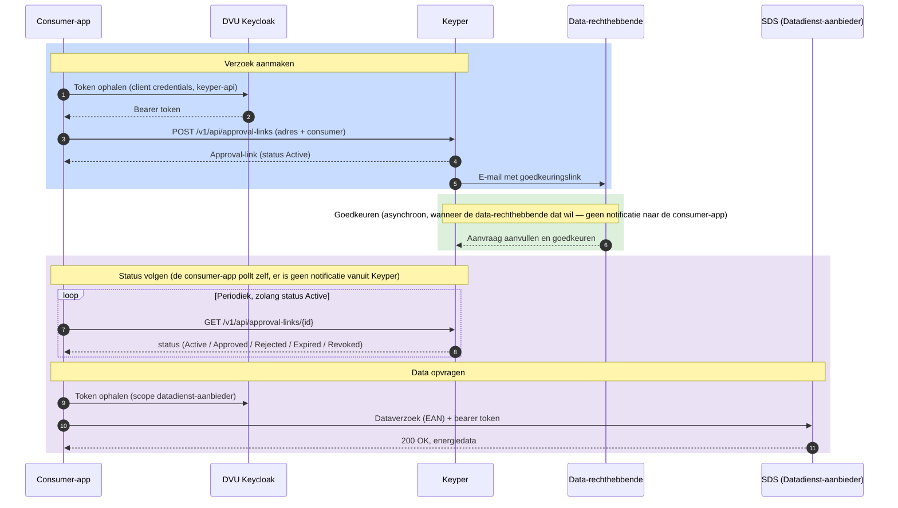

# Aansluiten als dataservice consumer

Deze gids is voor ontwikkelaars die een applicatie bouwen die namens een gebouweigenaar energiedata van een DVU-deelnemende datadienst-aanbieder wil ophalen. Je rol in DVU-terminologie is **dataservice consumer** — bijvoorbeeld een applicatie als Siemens of Bespaar Garant.

In deze flow verzorgt **Keyper** de toegangsverlening: het klaarzetten van een goedkeuringsverzoek voor de data-rechthebbende, het vastleggen van diens goedkeuring, en na goedkeuring het registreren van de policy en resource group in het DVU Autorisatieregister. Als dataservice consumer hoef je dat niet zelf te bouwen — je zet het verzoek klaar en haalt na goedkeuring de data op.

> **Belangrijk:** Deze flow via Keyper is de standaardmanier om als dataservice consumer toegang te krijgen. Wil je de toegangsverlening volledig zelf verzorgen zonder Keyper, dan is dat een control plane app — dat vereist aanvullende registratie bij Poort8 en is bedoeld voor een beperkte groep partijen (zie [Aansluiten als control plane app](aansluiten-control-plane.md)).

## Voor wie is deze gids?

Voor applicaties die:

- Energiedata van utiliteitsgebouwen willen afnemen via DVU
- Een goedkeuringsverzoek bij de gebouweigenaar willen klaarzetten via Keyper
- Daarna periodiek data willen ophalen bij een datadienst-aanbieder zoals SDS

## Wat deze gids beschrijft

- Hoe je een goedkeuringsverzoek indient via Keyper
- Wat er na goedkeuring gebeurt en hoe je de status volgt
- Hoe je na goedkeuring het gebouw (VBO) en de EAN's terugvindt
- Hoe je vervolgens energiedata opvraagt bij de datadienst-aanbieder

> **Buiten scope van deze gids:** Hoe de data-rechthebbende de aanvraag aanvult en goedkeurt verloopt via Keyper en valt buiten je eigen implementatie. Het opvraagformaat van de data (URL, parameters, response) wordt bepaald door de datadienst-aanbieder zelf; raadpleeg diens API-documentatie. Lees ook de [Keyper API documentatie ➚](<https://keyper-preview.poort8.nl/scalar/v1>) en de [DVU API documentatie ➚](<https://dvu-preview.poort8.nl/scalar/v1>) door.

## Procesoverzicht



## Voorwaarden

| Wat | Hoe |
|-----|-----|
| Organisatie + app geregistreerd en goedgekeurd in DVU Participantenregister | Zie [Onboarding](onboarding.md) |
| API-toegang tot de datadienst-aanbieder API en Keyper | Via de catalogus in de portal, zie [Onboarding – Stap 4](onboarding.md) |
| Keycloak `client_id` + `client_secret` | Wordt bij het registreren van de app uitgegeven |
| Akkoord van de gebouweigenaar | Per gebouw, via Keyper |

## Stap 1: Token ophalen voor Keyper

Voor het aanmaken van een goedkeuringsverzoek heb je een token nodig met scope `keyper-api`. Dit token is alleen geldig voor de Keyper API.

```http
POST https://auth.poort8.nl/realms/dvu-preview/protocol/openid-connect/token
Content-Type: application/x-www-form-urlencoded

grant_type=client_credentials
&client_id=<YOUR-CLIENT-ID>
&client_secret=<YOUR-CLIENT-SECRET>
&scope=keyper-api
```

Voor verzoeken aan de datadienst-aanbieder heb je later een apart token nodig met de scope van die aanbieder (zie [Stap 4](#stap-4-energiedata-opvragen)).

## Stap 2: Goedkeuringsverzoek aanmaken via Keyper

Maak een approval-link aan met flow `dvu.voeg-gebouw-toe@v1` (één gebouw) of `dvu.voeg-gebouwen-toe@v1` (meerdere gebouwen tegelijk). Je geeft **geen** policies of resource groups mee — de aanvraag wordt na het openen door de data-rechthebbende aangevuld en na goedkeuring geregistreerd.

De payload bevat het adres (postcode + huisnummer als één string) en `dataServiceConsumer`: het organisatie-ID van je eigen organisatie (de consumer die na goedkeuring de data mag ophalen). Het organisatie-ID is een iSHARE-DID volgens de conventie `did:ishare:EU.NL.NTRNL-<KvK>`.

Je kunt optioneel een `description` meegeven op de approval-link. De inhoud hiervan wordt getoond aan de data-rechthebbende bij het goedkeuren, onder het kopje "Wat kan `<dataServiceConsumer>` doen?". Gebruik dit veld om toe te lichten waarvoor de data-toegang gebruikt gaat worden — dit helpt de data-rechthebbende om een geïnformeerde keuze te maken.

```http
POST https://keyper-preview.poort8.nl/v1/api/approval-links
Authorization: Bearer <ACCESS_TOKEN>
Content-Type: application/json
```

**Één gebouw (`dvu.voeg-gebouw-toe@v1`):**

```json
{
  "requester": {
    "name": "<REQUESTER_NAME>",
    "email": "<REQUESTER_EMAIL>",
    "organization": "<REQUESTER_ORG>",
    "organizationId": "did:ishare:EU.NL.NTRNL-<REQUESTER_KVK_NUMBER>"
  },
  "approver": {
    "email": "<DATA_OWNER_EMAIL>",
    "organization": "<DATA_OWNER_ORG>",
    "organizationId": "did:ishare:EU.NL.NTRNL-<DATA_OWNER_KVK_NUMBER>"
  },
  "dataspace": {
    "baseUrl": "https://dvu-preview.poort8.nl"
  },
  "reference": "<UNIQUE_REFERENCE>",
  "description": "<OPTIONAL_DESCRIPTION>",
  "orchestration": {
    "flow": "dvu.voeg-gebouw-toe@v1",
    "payload": {
      "address": "1341 BA 1",
      "dataServiceConsumer": "did:ishare:EU.NL.NTRNL-<YOUR_KVK_NUMBER>"
    }
  }
}
```

**Meerdere gebouwen (`dvu.voeg-gebouwen-toe@v1`):**

```json
{
  "requester": {
    "name": "<REQUESTER_NAME>",
    "email": "<REQUESTER_EMAIL>",
    "organization": "<REQUESTER_ORG>",
    "organizationId": "did:ishare:EU.NL.NTRNL-<REQUESTER_KVK_NUMBER>"
  },
  "approver": {
    "email": "<DATA_OWNER_EMAIL>",
    "organization": "<DATA_OWNER_ORG>",
    "organizationId": "did:ishare:EU.NL.NTRNL-<DATA_OWNER_KVK_NUMBER>"
  },
  "dataspace": {
    "baseUrl": "https://dvu-preview.poort8.nl"
  },
  "reference": "<UNIQUE_REFERENCE>",
  "description": "<OPTIONAL_DESCRIPTION>",
  "orchestration": {
    "flow": "dvu.voeg-gebouwen-toe@v1",
    "payload": {
      "addresses": [
        "1341 BA 1",
        "5261 AD 1"
      ],
      "dataServiceConsumer": "did:ishare:EU.NL.NTRNL-<YOUR_KVK_NUMBER>"
    }
  }
}
```

De response bevat de `id`, `url` en `status` (`Active`) van de approval-link. Bewaar de `id` — daarmee volg je de status en haal je na goedkeuring het gebouw en de EAN's op. Zie de [Keyper API documentatie ➚](<https://keyper-preview.poort8.nl/scalar/v1>) voor het volledige schema.

## Stap 3: Status volgen en het gebouw terugvinden

Nadat de data-rechthebbende de link heeft geopend, vult deze de aanvraag aan (welke aansluitingen, kleinverbruik of grootverbruik, en bij grootverbruik het meetbedrijf) en keurt goed. Deze stappen verlopen via Keyper en vallen buiten je eigen implementatie.

Volg de status door de approval-link op te vragen:

```http
GET https://keyper-preview.poort8.nl/v1/api/approval-links/{id}
Authorization: Bearer <ACCESS_TOKEN>
```

Zodra `status` gelijk is aan `Approved`, bevat de response onder `addResourceGroupTransactions` het **VBO-ID** (`resourceGroupId`) en de bijbehorende **EAN's** (de resources). Daarmee weet je voor welke EAN's je data mag opvragen — zonder dat je zelf toegang tot het Autorisatieregister nodig hebt.

## Stap 4: Energiedata opvragen

Vraag een nieuw token op, nu met de scope van de datadienst-aanbieder (de `client_id` van diens API zoals geregistreerd in de catalogus):

```http
POST https://auth.poort8.nl/realms/dvu-preview/protocol/openid-connect/token
Content-Type: application/x-www-form-urlencoded

grant_type=client_credentials
&client_id=<YOUR-CLIENT-ID>
&client_secret=<YOUR-CLIENT-SECRET>
&scope=<DATADIENST_AANBIEDER_API_CLIENT_ID>
```

Stuur daarna het dataverzoek naar de datadienst-aanbieder, met een van de EAN's uit stap 3. De exacte URL, parameters en het responseformaat worden bepaald door de datadienst-aanbieder zelf — raadpleeg diens API-documentatie. Het enige dat DVU vereist is dat je een geldig bearer token meestuurt:

```http
GET https://<datadienst-aanbieder>/<endpoint-per-aanbieder>
Authorization: Bearer <ACCESS_TOKEN>
```

De datadienst-aanbieder valideert het token, controleert of er een geldige policy bestaat, en levert daarna de data uit.

## Foutafhandeling

| Code | Betekenis | Actie |
|------|-----------|-------|
| `401 Unauthorized` | Token ontbreekt, is verlopen of ongeldig | Vraag een nieuw token aan |
| `403 Forbidden` | Geen geldige policy gevonden | Controleer of de goedkeuring is afgerond (status `Approved`) |
| `400 Bad Request` | Verkeerde of ontbrekende parameters | Controleer request parameters |

## Hulp nodig?

- Algemene vragen over DVU: [**BeheerDVU@rvo.nl**](<mailto:BeheerDVU@rvo.nl>)
- Technische vragen of inhoudelijke ondersteuning: [**hello@poort8.nl**](<mailto:hello@poort8.nl>)
